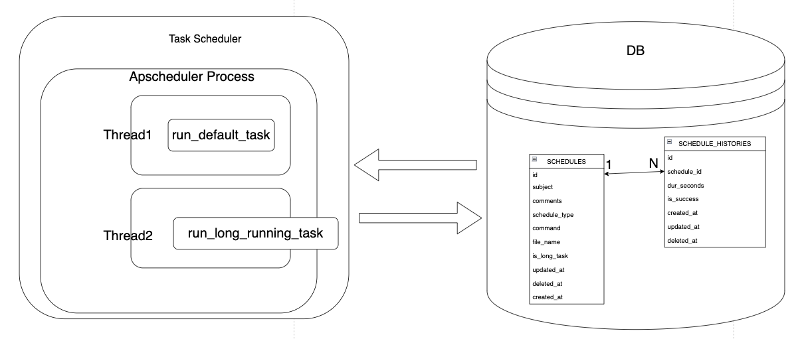

# fastSchedule
cron 명령어 기반으로 schedule을 실행합니다.

## Features

- cron 명령 기반, schedule 실행
- 현재 등록된 schedule 확인
- 실행된 schedule 이력 조회

## DB 설정
```yml
# apis/configs/config_dev.yml 및 config_prod.yml에 설정합니다

databases:
  inner:
    host: "somthing.db.host.com"
    port: 3306
    database: "database_name"
    username: "username"
    password: "password"
    timezone: "+09:00"
```

## Installation

```sh
cd apis
poetry install
cd ../
python -m uvicorn main:app
```

## 구조
Scheduler는 생성자에서 아래와 같은 동작을 합니다.
- Apscheduler 프로세스를 띄웁니다. 
- Apscheduler에 run_default_task 스케쥴을1분 간격으로 실행하도록 스케쥴링에 추가합니다.
- Apscheduler에 run_long_running_task 스케쥴을 10분 간격으로 실행하도록 스케쥴링에 추가합니다.
- DB에 등록된 schedule을  조회 후, cron 조건에 맞는 것은 실행하는 스케쥴을 일정한 주기(1분, 10분)로 실행합니다.
 
